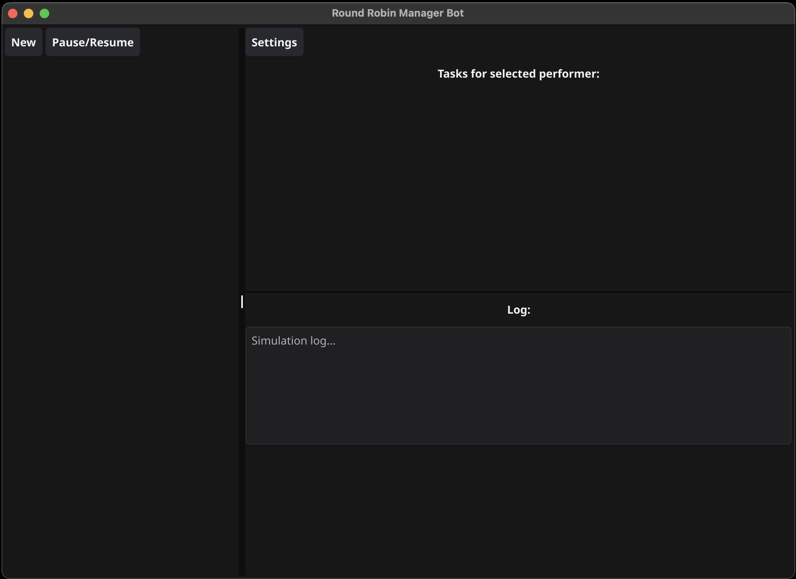
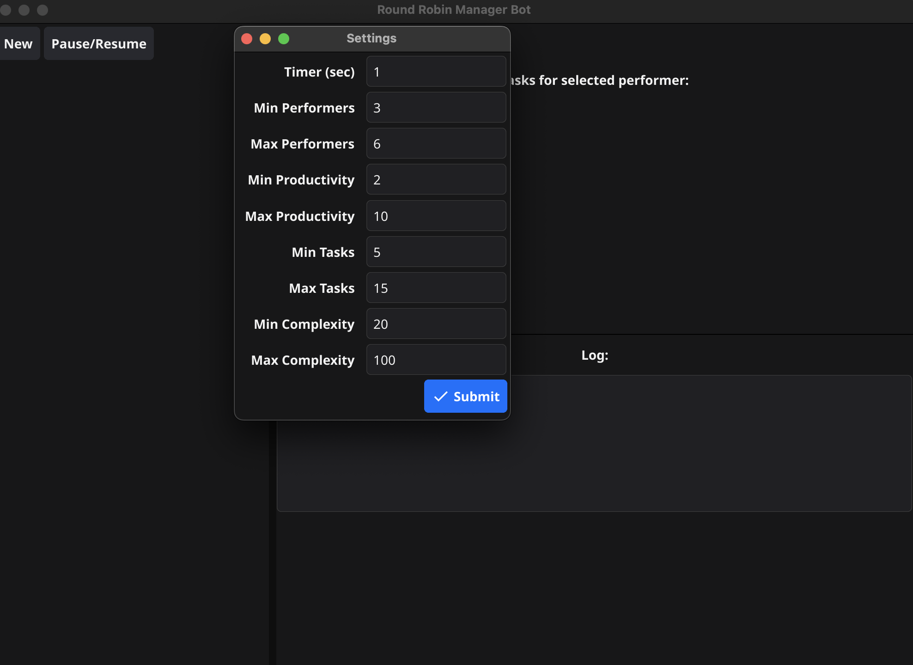
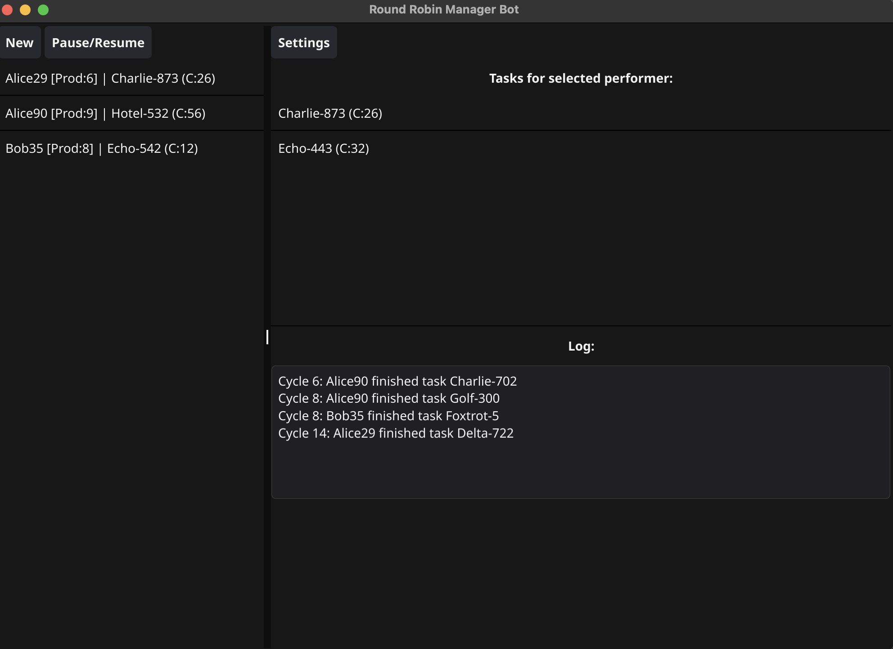
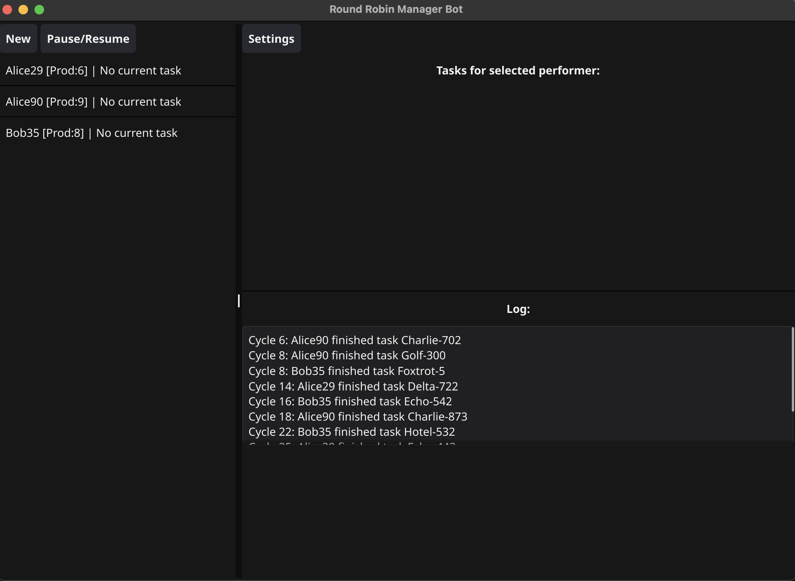

# Менеджер-бот и round-robin

Популярный алгоритм распределения нагрузки между исполнителями round-robin подразумевает наличие N исполнителей и M задач, обычно N много меньше чем M. Алгоритм заключается в простом распределении задач по исполнителям в цикле. Первому исполнителю назначается первая задача, второму -- вторая и т. д. N+1 - я задача снова назначается первому исполнителю, и так далее по кругу.

~~~go
go run .
~~~

## Работа программы

### Стартовый экран

### Экран настройки

### Работа менеджера

### Окончание программы

